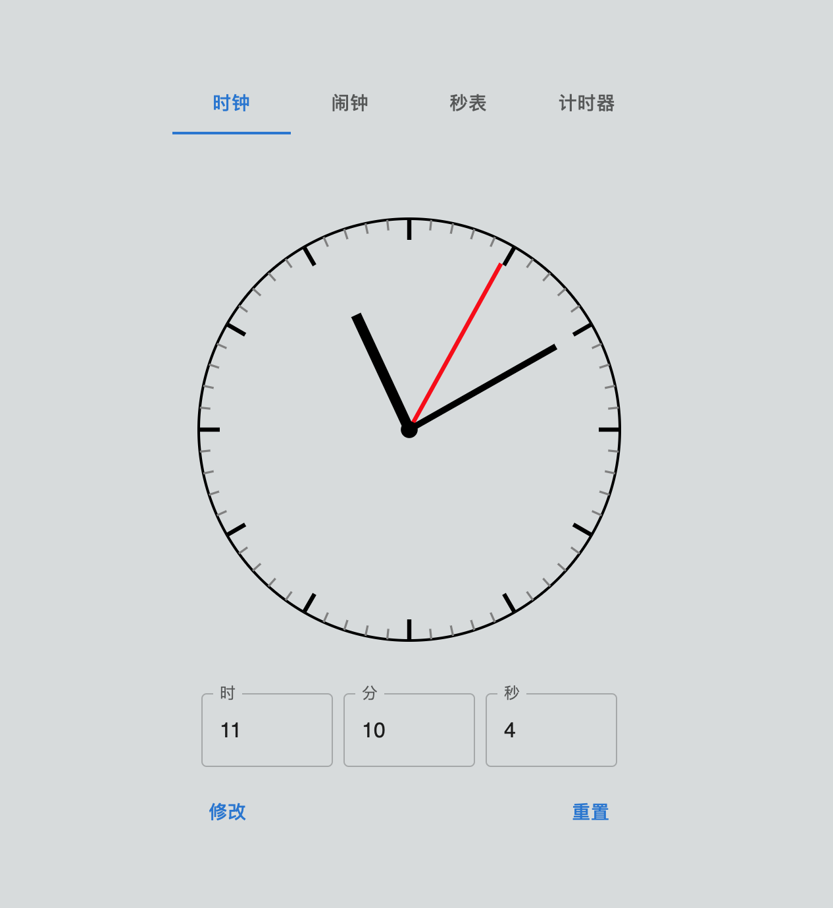

# 模拟时钟 React 组件

## 运行方法

需要预先安装：

* node.js

在项目根目录打开终端，安装依赖

```sh
npm install
```

运行项目

```sh
npm dev
```

在浏览器中访问页面所在的 url（默认为 localhost:3000）

应该看到类似以下的场景



## 目标清单

### 时钟

- [x] 绘制简单的表盘
- [x] 指针按照正常时间走动
- [x] 在合适的位置同步显示数字时间
- [x] 通过输入框修改时间
- [x] 可以用鼠标拨动指针
- [x] 确保时针和分针的正确位置关系

### 闹钟

### 秒表

- [x] 启动 & 暂停
- [x] 复位
- [ ] 分段
- [x] 时钟显示时间

### 计时器

- [x] 通过编辑数字设置倒计时时间
- [x] 取消编辑
- [x] 暂停 & 恢复
- [x] 时钟显示时间
- [ ] 计时结束提示

### 杂项

- [ ] 对深色模式的支持